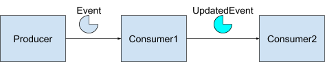

<html><head><meta content="text/html; charset=UTF-8" http-equiv="content-type"></head><body class="c52">
SpringOne Workshop Labs

Building Event-Driven Workflows with Knative and Tekton
<h1 class="c33" id="h.wj2ddq0na8">Preface</h1><h2 class="c20" id="h.diwi0tqu4krx">Icons used in this document</h2>

<table class="c7"><tbody><tr class="c16"><td class="c17" colspan="1" rowspan="1">

</td><td class="c11" colspan="1" rowspan="1">
Information message, please read these carefully
</td></tr><tr class="c16"><td class="c17" colspan="1" rowspan="1">

</td><td class="c11" colspan="1" rowspan="1">
Code snippet, you can use these snippets to complete the tasks
</td></tr><tr class="c16"><td class="c17" colspan="1" rowspan="1">

</td><td class="c11" colspan="1" rowspan="1">
Do-It-Yourself, using the explanations try your hand at some exercises using the tools and technology in this workshop
</td></tr></tbody></table>

<h2 class="c20" id="h.kg10u44zid42">General notes</h2>

<table class="c7"><tbody><tr class="c16"><td class="c17" colspan="1" rowspan="1">

</td><td class="c11" colspan="1" rowspan="1">
The commands in this document have been created with Linux / macOS in mind. The Windows versions of these commands might differ from the examples.
</td></tr></tbody></table>

<h1 class="c33" id="h.p6wrkvxueov7">Kubernetes in Docker</h1><h2 class="c20" id="h.oybitbkzegl">Install KinD</h2>

kind is a tool for running local Kubernetes clusters using Docker container &ldquo;nodes&rdquo;.

kind was primarily designed for testing Kubernetes itself, but may be used for local development or CI.

Source: <a class="c49" href="https://www.google.com/url?q=https://kind.sigs.k8s.io/&amp;sa=D&amp;ust=1599151576269000&amp;usg=AOvVaw3V7YZs5bHhTzF91ahTpRYl">KinD website</a>

For this workshop you&rsquo;ll need version 0.8.0 or higher

<table class="c7"><tbody><tr class="c16"><td class="c17" colspan="1" rowspan="1">

</td><td class="c11" colspan="1" rowspan="1">
curl -Lo ./kind&nbsp;https://kind.sigs.k8s.io/dl/v0.8.1/kind-$(uname -s)-amd64

chmod +x ./kind

mv ./kind&nbsp;/some-dir-in-your-PATH/kind
</td></tr></tbody></table>

<h2 class="c20" id="h.ppg64dh9ipug">Create a Kubernetes cluster</h2>
You&rsquo;ll need to configure kind to expose port 80 to the host machine. That port will be used by Kourier (an ingress controller) a little later on.

<table class="c7"><tbody><tr class="c16"><td class="c17" colspan="1" rowspan="1">

</td><td class="c11" colspan="1" rowspan="1">
cat &gt;&nbsp;clusterconfig.yaml &lt;&lt;EOF

kind: Cluster

apiVersion: kind.x-k8s.io/v1alpha4

nodes:

- role: control-plane

&nbsp; extraPortMappings:

&nbsp; - containerPort: 31080

&nbsp; &nbsp; hostPort: 80

EOF
</td></tr></tbody></table>

You can create a new cluster, with the above configuration using the below command.

<table class="c7"><tbody><tr class="c16"><td class="c17" colspan="1" rowspan="1">

</td><td class="c11" colspan="1" rowspan="1">
kind create cluster --name springone --config clusterconfig.yaml
</td></tr></tbody></table>

<h1 class="c33" id="h.c86ip4lbnk61">Some additional tools</h1><h2 class="c20" id="h.o5tt6m4l0rm2">kubectl</h2>
The Kubernetes command-line tool, kubectl, allows you to run commands against Kubernetes clusters. You can use kubectl to deploy applications, inspect and manage cluster resources, and view logs. You&rsquo;ll be working with Kubernetes, so you&rsquo;ll need the kubectl&nbsp;command line tool.

<table class="c7"><tbody><tr class="c16"><td class="c17" colspan="1" rowspan="1">

</td><td class="c11" colspan="1" rowspan="1">
curl -LO &quot;https://storage.googleapis.com/kubernetes-release/release/$(curl -s https://storage.googleapis.com/kubernetes-release/release/stable.txt)/bin/linux/amd64/kubectl&quot;

chmod +x ./kubectl

mv ./kubectl&nbsp;/some-dir-in-your-PATH/kubectl
</td></tr></tbody></table>

<h2 class="c20" id="h.usl77e4d6ugf">kn</h2>
The command line tool that manages Knative is called kn. The tool manages both the eventing and serving parts of Knative. You&rsquo;ll build functions with Knative, so you&rsquo;ll need the kn&nbsp;command line tool.

<table class="c7"><tbody><tr class="c16"><td class="c17" colspan="1" rowspan="1">

</td><td class="c11" colspan="1" rowspan="1">
curl -Lo ./kn&nbsp;https://github.com/knative/client/releases/download/v0.16.0/kn-$(uname -s)-amd64

chmod +x ./kn

mv ./kn&nbsp;/some-dir-in-your-PATH/kn
</td></tr></tbody></table>

<h2 class="c20" id="h.ezaoc8ed4x6j">tkn</h2>
The command line tool that manages Tekton is called tkn. This tool allows you to access all Tekton resources needed in this workshop. You&rsquo;ll build pipelines with Tekton, so you&rsquo;ll need the tkn&nbsp;command line tool.

<table class="c7"><tbody><tr class="c16"><td class="c17" colspan="1" rowspan="1">

</td><td class="c11" colspan="1" rowspan="1">
curl -LO https://github.com/tektoncd/cli/releases/download/v0.11.0/tkn_0.11.0_$(uname -s)_x86_64.tar.gz

tar xvzf tkn_0.11.0_$(uname -s)_x86_64.tar.gz -C /some-dir-in-your-PATH&nbsp;tkn
</td></tr></tbody></table>

<h2 class="c20" id="h.q9x2c2bsem40">k9s</h2>
To keep track of what&rsquo;s happening in your cluster you can use K9s. K9s is a terminal based UI to interact with your Kubernetes clusters. The aim of this project is to make it easier to navigate, observe and manage your deployed applications in the wild. K9s continually watches Kubernetes for changes and offers subsequent commands to interact with your observed resources.

<table class="c7"><tbody><tr class="c16"><td class="c17" colspan="1" rowspan="1">

</td><td class="c11" colspan="1" rowspan="1">
curl -LO https://github.com/derailed/k9s/releases/download/v0.21.4/k9s_$(uname -s)_x86_64.tar.gz

tar xvzf k9s_$(uname -s)_x86_64.tar.gz -C /some-dir-in-your-PATH&nbsp;k9s
</td></tr></tbody></table>

<h2 class="c20 c35" id="h.p744e7pheyo"></h2><h2 class="c20" id="h.iplva7vrbre2">Octant</h2>
Octant is an open source developer-centric web interface for Kubernetes that lets you inspect a Kubernetes cluster and its applications. It provides a visual interface to managing Kubernetes that complements and extends existing tools like kubectl and kustomize and supports a variety of debugging features such as filtering labels and streaming container logs to be part of the Kubernetes development toolkit. Throughout this workshop, you can use Octant to see what&rsquo;s happening in your cluster too.

<table class="c7"><tbody><tr class="c16"><td class="c17" colspan="1" rowspan="1">

</td><td class="c11" colspan="1" rowspan="1">
To install Octant:

* download the latest release from the Octant GitHub repository: <a class="c49" href="https://www.google.com/url?q=https://github.com/vmware-tanzu/octant/releases/tag/v0.15.0&amp;sa=D&amp;ust=1599151576287000&amp;usg=AOvVaw3lS55alLSytp_3mHSDapkJ">https://github.com/vmware-tanzu/octant/releases/tag/v0.15.0</a>

* extract the zipped or gzipped file

* start the octant executable

* open a webbrowser to http://127.0.0.1:7777
</td></tr></tbody></table>

<h1 class="c33 c45" id="h.4pcpu313kcsm"></h1><h1 class="c33" id="h.mh50pyltanbq">Knative Serving</h1><h2 class="c20" id="h.59rwjdrskdpt">Install Knative Serving to your cluster</h2>
You&rsquo;re ready to install Knative serving. Knative components build on top of Kubernetes, abstracting away the complex details and enabling developers to focus on what matters. Built by codifying the best practices shared by successful real-world implementations, Knative solves the &ldquo;boring but difficult&rdquo; parts of deploying and managing cloud native services so you don&rsquo;t have to. Knative Serving runs serverless containers on Kubernetes with ease, Knative takes care of the details of networking, autoscaling (even to zero), and revision tracking. You just have to focus on your core logic.

<table class="c7"><tbody><tr class="c16"><td class="c17" colspan="1" rowspan="1">

</td><td class="c11" colspan="1" rowspan="1">
kubectl apply -f&nbsp;https://github.com/knative/serving/releases/download/v0.16.0/serving-crds.yaml

kubectl apply -f&nbsp;https://github.com/knative/serving/releases/download/v0.16.0/serving-core.yaml

kubectl wait&nbsp;deployment activator autoscaler controller webhook --for=condition=Available -n&nbsp;knative-serving --timeout=-1s
</td></tr></tbody></table>

If you&rsquo;re curious what just happened to your cluster, you can check the Octant user interface on http://127.0.0.1:7777:

<h2 class="c20" id="h.h87suk1dig8n">Setting up your ingress with Kourier</h2>
Kourier is an Ingress for &nbsp;Knative Serving. Kourier is a lightweight alternative for the Istio ingress as its deployment consists only of an Envoy proxy and a control plane for it. You&rsquo;ll need to install Kourier in the kourier-system&nbsp;namespace.

<table class="c7"><tbody><tr class="c16"><td class="c17" colspan="1" rowspan="1">

</td><td class="c11" colspan="1" rowspan="1">
kubectl apply -f&nbsp;https://github.com/knative/net-kourier/releases/download/v0.16.0/kourier.yaml

kubectl wait&nbsp;deployment 3scale-kourier-control 3scale-kourier-gateway --for=condition=Available -n&nbsp;kourier-system --timeout=-1s
</td></tr></tbody></table>

Kind is running on your local machine, so the external IP address is your local host (127.0.0.1). You&rsquo;ll need that external IP address in other steps as well, so it&rsquo;s useful to export it to a variable.

<table class="c7"><tbody><tr class="c16"><td class="c17" colspan="1" rowspan="1">

</td><td class="c11" colspan="1" rowspan="1">
export&nbsp;EXTERNAL_IP=&quot;127.0.0.1&quot;
</td></tr></tbody></table>

nip.io is a dead simple wildcard DNS for any IP Address. nip.io allows you to do that by mapping any IP Address to a hostname, which means you can stop editing your etc/hosts file with custom hostname and IP address mappings. Using the external IP address, you can use nip.io to make sure any DNS query resolves to that IP address.

<table class="c7"><tbody><tr class="c16"><td class="c17" colspan="1" rowspan="1">

</td><td class="c11" colspan="1" rowspan="1">
export&nbsp;KNATIVE_DOMAIN=&quot;$EXTERNAL_IP.nip.io&quot;
</td></tr></tbody></table>

To validate it works properly, you can use the dig&nbsp;command.

<table class="c7"><tbody><tr class="c16"><td class="c17" colspan="1" rowspan="1">

</td><td class="c11" colspan="1" rowspan="1">
dig $KNATIVE_DOMAIN
</td></tr></tbody></table>

Now you need to update the DNS settings for Knative to make sure that Knative knows about the DNS settings. To do that, you&rsquo;ll need to patch the config-domain&nbsp;config map.

<table class="c7"><tbody><tr class="c16"><td class="c17" colspan="1" rowspan="1">

</td><td class="c11" colspan="1" rowspan="1">
kubectl patch configmap -n&nbsp;knative-serving config-domain -p&nbsp;&quot;{\&quot;data\&quot;: {\&quot;$KNATIVE_DOMAIN\&quot;: \&quot;\&quot;}}&quot;
</td></tr></tbody></table>

To validate that command was executed successfully, you can describe&nbsp;the config map.

<table class="c7"><tbody><tr class="c16"><td class="c17" colspan="1" rowspan="1">

</td><td class="c11" colspan="1" rowspan="1">
kubectl describe configmap -n&nbsp;knative-serving config-domain
</td></tr></tbody></table>

Now that the configuration is almost done, you&rsquo;ll need to configure Kourier to listen for http traffic on port 80 of the kind node and change the service type to NodePort instead of LoadBalancer.

<table class="c7"><tbody><tr class="c16"><td class="c17" colspan="1" rowspan="1">

</td><td class="c11" colspan="1" rowspan="1">
cat &lt;&lt;EOF&nbsp;| kubectl apply -f -

apiVersion: v1

kind: Service

metadata:

&nbsp; name: kourier-ingress

&nbsp; namespace: kourier-system

&nbsp; labels:

&nbsp; &nbsp; networking.knative.dev/ingress-provider: kourier

spec:

&nbsp; type: NodePort

&nbsp; selector:

&nbsp; &nbsp; app: 3scale-kourier-gateway

&nbsp; ports:

&nbsp; &nbsp; - name: http2

&nbsp; &nbsp; &nbsp; nodePort: 31080

&nbsp; &nbsp; &nbsp; port: 80

&nbsp; &nbsp; &nbsp; targetPort: 8080

EOF
</td></tr></tbody></table>

The last step is to update the configuration of Knative to use Kourier.

<table class="c7"><tbody><tr class="c16"><td class="c17" colspan="1" rowspan="1">

</td><td class="c11" colspan="1" rowspan="1">
kubectl patch configmap -n&nbsp;knative-serving --type merge config-network -p&nbsp;&#39;{&quot;data&quot;:{&quot;ingress.class&quot;:&quot;kourier.ingress.networking.knative.dev&quot;}}&#39;
</td></tr></tbody></table>

To validate that command was executed successfully, you can describe&nbsp;the config map.

<table class="c7"><tbody><tr class="c16"><td class="c17" colspan="1" rowspan="1">

</td><td class="c11" colspan="1" rowspan="1">
kubectl describe configmap -n&nbsp;knative-serving config-network
</td></tr></tbody></table>

To make sure everything is okay, all pods should be in Running&nbsp;state and your kourier-ingress&nbsp;service configured.

<table class="c7"><tbody><tr class="c16"><td class="c17" colspan="1" rowspan="1">

</td><td class="c11" colspan="1" rowspan="1">
kubectl get pods -n&nbsp;knative-serving

kubectl get pods -n&nbsp;kourier-system

kubectl get svc &nbsp;-n&nbsp;kourier-system kourier-ingress
</td></tr></tbody></table>

<h2 class="c20" id="h.afx9frcstew3">Deploying your first app</h2>
You&rsquo;re now ready to deploy our first application, and play around with scaling to zero and traffic splitting (super useful if you want to do A/B testing or roll out features that shouldn&rsquo;t get traffic yet). To show these concepts you&rsquo;ll use the hello-world sample from Knative. For now, we&rsquo;ll set the autoscale window to 15 seconds, which means that the service is scaled to zero if no request was received during that time.

<table class="c7"><tbody><tr class="c16"><td class="c17" colspan="1" rowspan="1">

</td><td class="c11" colspan="1" rowspan="1">
kn service create hello --image gcr.io/knative-samples/helloworld-go&nbsp;--autoscale-window 15s
</td></tr></tbody></table>

You can check that the service was created with the below command.

<table class="c7"><tbody><tr class="c16"><td class="c17" colspan="1" rowspan="1">

</td><td class="c11" colspan="1" rowspan="1">
kn service list hello
</td></tr></tbody></table>

In a separate terminal window, run the below command to see how the containers are created and terminated when you invoke your app.

<table class="c7"><tbody><tr class="c16"><td class="c17" colspan="1" rowspan="1">

</td><td class="c11" colspan="1" rowspan="1">
kubectl get pod -l serving.knative.dev/service=hello -w
</td></tr></tbody></table>

You can call your app using the below curl command.

<table class="c7"><tbody><tr class="c16"><td class="c17" colspan="1" rowspan="1">

</td><td class="c11" colspan="1" rowspan="1">
curl http://hello.default.127.0.0.1.nip.io
</td></tr></tbody></table><h2 class="c20" id="h.opfl5uwkols1">Dynamic scaling</h2>

<table class="c7"><tbody><tr class="c16"><td class="c17" colspan="1" rowspan="1">

</td><td class="c11" colspan="1" rowspan="1">
Using your favorite load testing tool, try to send as much traffic as you can to that URL to see the dynamic scaling in action.
</td></tr></tbody></table>

<h2 class="c20" id="h.lz27inrumrqf">Updating your app</h2>
Saying hello to the world is nice, but saying it to the rest of the SpringOne conference is even better &#x1f609; Let&rsquo;s update the environment variable TARGET&nbsp;with a new message.

<table class="c7"><tbody><tr class="c16"><td class="c17" colspan="1" rowspan="1">

</td><td class="c11" colspan="1" rowspan="1">
kn service update hello --env TARGET=&quot;SpringOne!&quot;

Note: if you&rsquo;re using zsh as your terminal you might need to escape the exclamation point (\!)
</td></tr></tbody></table>

You can call your app using the same URL and see a different message

<table class="c7"><tbody><tr class="c16"><td class="c17" colspan="1" rowspan="1">

</td><td class="c11" colspan="1" rowspan="1">
curl http://hello.default.127.0.0.1.nip.io
</td></tr></tbody></table>

<h2 class="c20" id="h.5md27e6zqaph">Viewing resources</h2>
Within Octant you can see all revisions under &ldquo;custom resources -&gt; revisions.serving.knative.dev&rdquo;. From a Knative point of view, these resources are immutable so you cannot make any changes. It does however, give you an amazing overview of all the Kubernetes objects that are created when you run the kn service create&nbsp;command.

You can create new services using the Octant UI as well. Click on &ldquo;Apply YAML&rdquo; in the top right corner and paste the below snippet. After that, hit apply to create a new Knative service.

<table class="c7"><tbody><tr class="c16"><td class="c17" colspan="1" rowspan="1">

</td><td class="c11" colspan="1" rowspan="1">
apiVersion:&nbsp;serving.knative.dev/v1

kind:&nbsp;Service

metadata:

&nbsp; name:&nbsp;octant-knative

&nbsp; namespace:&nbsp;default

spec:

&nbsp; template:

&nbsp; &nbsp; spec:

&nbsp; &nbsp; &nbsp; containers:

&nbsp; &nbsp; &nbsp; &nbsp; -&nbsp;image:&nbsp;gcr.io/knative-samples/helloworld-go

&nbsp; &nbsp; &nbsp; &nbsp; &nbsp; env:

&nbsp; &nbsp; &nbsp; &nbsp; &nbsp; &nbsp; -&nbsp;name:&nbsp;TARGET

&nbsp; &nbsp; &nbsp; &nbsp; &nbsp; &nbsp; &nbsp; value:&nbsp;&quot;Octant&quot;

</td></tr></tbody></table>

You can call your app using the same URL and see a different message

<table class="c7"><tbody><tr class="c16"><td class="c17" colspan="1" rowspan="1">

</td><td class="c11" colspan="1" rowspan="1">
curl http://octant-knative.default.127.0.0.1.nip.io
</td></tr></tbody></table>

<h2 class="c20" id="h.hhtz4mxnst3k">Splitting traffic</h2>
But what if you&rsquo;re not entirely sure that this is the right message? That&rsquo;s where A_B testing comes in. A/B testing (also known as bucket testing or split-run testing) is a user experience research methodology. A/B tests consist of a randomized experiment with two variants, A and B. To do that, we can split the traffic between the first version of the service (which said hello to the world) and the second one (which said hello to SpringOne)

First, you&rsquo;ll need to tag&nbsp;the first version of the service. You can get a list of all revisions (versions) with the below command.

<table class="c7"><tbody><tr class="c16"><td class="c17" colspan="1" rowspan="1">

</td><td class="c11" colspan="1" rowspan="1">
kn revision list
</td></tr></tbody></table>

The first version, which will be on the bottom of the list (with no value in the traffic column) is the first version. To tag that one, run the below command.

<table class="c7"><tbody><tr class="c16"><td class="c17" colspan="1" rowspan="1">

</td><td class="c11" colspan="1" rowspan="1">
kn service update hello --tag &lt;revision name&gt;=v1
</td></tr></tbody></table>

To set up traffic splitting between the tagged V1 version and the latest version (for a 75/25&nbsp;split), you can run the below command.

<table class="c7"><tbody><tr class="c16"><td class="c17" colspan="1" rowspan="1">

</td><td class="c11" colspan="1" rowspan="1">
kn service update hello --traffic v1=75,@latest=25
</td></tr></tbody></table>

The commands kn revision list&nbsp;and kn service describe hello&nbsp;should now show you a split in traffic. To see that in action, run the below command.

<table class="c7"><tbody><tr class="c16"><td class="c17" colspan="1" rowspan="1">

</td><td class="c11" colspan="1" rowspan="1">
while&nbsp;true;&nbsp;do

curl http://hello.default.127.0.0.1.nip.io

sleep 0.5

done
</td></tr></tbody></table>

<table class="c7"><tbody><tr class="c16"><td class="c17" colspan="1" rowspan="1">

</td><td class="c11" colspan="1" rowspan="1">
You can try setting different percentages to see the changes in the response to the above command.
</td></tr></tbody></table>

This is great! Now let&rsquo;s prepare for VMworld 2020, next month&hellip; The new version should be ready and testable, though you don&rsquo;t want to expose this version to everyone just yet. To do that, you&rsquo;ll have to create a new revision and split traffic accordingly.

You&rsquo;ll need to tag the current version (V2) first

<table class="c7"><tbody><tr class="c16"><td class="c17" colspan="1" rowspan="1">

</td><td class="c11" colspan="1" rowspan="1">
kn service update hello --tag $(kubectl get ksvc hello --template=&#39;{{.status.latestReadyRevisionName}}&#39;)=v2
</td></tr></tbody></table>

Now, let&rsquo;s create a new version for VMworld 2020, tag it with V3 (you&rsquo;ll see why in just a second) and split traffic so that it doesn&rsquo;t get any traffic at all.

<table class="c7"><tbody><tr class="c16"><td class="c17" colspan="1" rowspan="1">

</td><td class="c11" colspan="1" rowspan="1">
kn service update hello --env TARGET=&quot;VMworld 2020!&quot;&nbsp;--tag @latest=v3 --traffic v1=75,v2=25,@latest=0
</td></tr></tbody></table>

The commands kn revision list&nbsp;and kn service describe hello&nbsp;should show you the same split in traffic as before (and also show the new version getting no traffic). If you want to try it out, you can use the below command.

<table class="c7"><tbody><tr class="c16"><td class="c17" colspan="1" rowspan="1">

</td><td class="c11" colspan="1" rowspan="1">
while&nbsp;true;&nbsp;do

curl http://hello.default.127.0.0.1.nip.io

sleep 0.5

done
</td></tr></tbody></table>

You can access specific versions of the service with http://&lt;tag&gt;-hello.default.127.0.0.1.nip.io. So even though V3 of the service isn&rsquo;t getting any traffic you can send it a request with the below curl command.

<table class="c7"><tbody><tr class="c16"><td class="c17" colspan="1" rowspan="1">

</td><td class="c11" colspan="1" rowspan="1">
curl http://v3-hello.default.127.0.0.1.nip.io
</td></tr></tbody></table>

Now let&rsquo;s assume that we&rsquo;re at VMworld 2020 and need to get this version of the service live and direct all traffic here. You can do that with the below command.

<table class="c7"><tbody><tr class="c16"><td class="c17" colspan="1" rowspan="1">

</td><td class="c11" colspan="1" rowspan="1">
kn service update hello --traffic @latest=100
</td></tr></tbody></table>

The commands kn revision list&nbsp;and kn service describe hello&nbsp;should now show you that all traffic is sent to version 3. If you want to try it out, you can use the below command.

<table class="c7"><tbody><tr class="c16"><td class="c17" colspan="1" rowspan="1">

</td><td class="c11" colspan="1" rowspan="1">
while&nbsp;true;&nbsp;do

curl http://hello.default.127.0.0.1.nip.io

sleep 0.5

done
</td></tr></tbody></table>

You can still access the older versions with curl http://v1-hello.default.127.0.0.1.nip.io&nbsp;or &nbsp;curl http://v2-hello.default.127.0.0.1.nip.io

To get a complete YAML overview of everything that you&rsquo;ve done so far, you can use the experimental export --with-revisions&nbsp;command.

<table class="c7"><tbody><tr class="c16"><td class="c17" colspan="1" rowspan="1">

</td><td class="c11" colspan="1" rowspan="1">
kn service export hello --with-revisions --mode=export -o&nbsp;yaml
</td></tr></tbody></table>

<h1 class="c33 c45" id="h.geneo0sqcdmo"></h1><h1 class="c33" id="h.bu6udzyuqjzr">Tekton</h1><h2 class="c20" id="h.aw04eqbvb4hc">Install Tekton</h2>
So far you&rsquo;ve done a lot manually. Let&rsquo;s go and automate some of this! Tekton is a powerful yet flexible Kubernetes-native open-source framework for creating continuous integration and delivery (CI/CD) systems. It lets you build, test, and deploy across multiple cloud providers or on-premises systems by abstracting away the underlying implementation details. You&rsquo;ll need to install Tekton in the namespace tekton-pipelines.

<table class="c7"><tbody><tr class="c16"><td class="c17" colspan="1" rowspan="1">

</td><td class="c11" colspan="1" rowspan="1">
kubectl apply -f&nbsp;https://github.com/tektoncd/pipeline/releases/download/v0.14.1/release.yaml

kubectl wait deployment tekton-pipelines-controller tekton-pipelines-webhook --for=condition=Available -n&nbsp;tekton-pipelines
</td></tr></tbody></table>

Some cool features of Tekton include that Tekton Pipelines are Cloud Native:
<ul class="c46 lst-kix_vuc3fiwbn0el-0 start"><li class="c2 c30">Run on Kubernetes</li><li class="c2 c30">Have Kubernetes clusters as a first class type</li><li class="c2 c30">Use containers as their building blocks</li></ul>

Tekton Pipelines are Decoupled:
<ul class="c46 lst-kix_4p3a64mz17zi-0 start"><li class="c2 c30">One Pipeline can be used to deploy to any k8s cluster</li><li class="c2 c30">The Tasks which make up a Pipeline can easily be run in isolation</li><li class="c2 c30">Resources such as git repos can easily be swapped between runs</li></ul>

To get some visibility into what Tekton is doing, you can install the Tekton dashboard too.

<table class="c7"><tbody><tr class="c16"><td class="c17" colspan="1" rowspan="1">

</td><td class="c11" colspan="1" rowspan="1">
kubectl apply -f&nbsp;https://github.com/tektoncd/dashboard/releases/download/v0.7.1/tekton-dashboard-release.yaml

kubectl wait deployment tekton-dashboard --for=condition=Available -n&nbsp;tekton-pipelines
</td></tr></tbody></table>

You can use Kourier to make the dashboard accessible to your host on the URL http://dashboard.tekton-pipelines.127.0.0.1.nip.io. If you want a different URL, you can change the &ldquo;hosts&rdquo; element in the below command.

<table class="c7"><tbody><tr class="c16"><td class="c17" colspan="1" rowspan="1">

</td><td class="c11" colspan="1" rowspan="1">
cat &lt;&lt;EOF&nbsp;| kubectl apply -f -

apiVersion: networking.internal.knative.dev/v1alpha1

kind: Ingress

metadata:

&nbsp; name: tekton-dashboard

&nbsp; namespace: tekton-pipelines

&nbsp; annotations:

&nbsp; &nbsp; networking.knative.dev/ingress.class: kourier.ingress.networking.knative.dev

spec:

&nbsp; rules:

&nbsp; - hosts:

&nbsp; &nbsp; - dashboard.tekton-pipelines.$KNATIVE_DOMAIN

&nbsp; &nbsp; http:

&nbsp; &nbsp; &nbsp; paths:

&nbsp; &nbsp; &nbsp; - splits:

&nbsp; &nbsp; &nbsp; &nbsp; - appendHeaders: {}

&nbsp; &nbsp; &nbsp; &nbsp; &nbsp; serviceName: tekton-dashboard

&nbsp; &nbsp; &nbsp; &nbsp; &nbsp; serviceNamespace: tekton-pipelines

&nbsp; &nbsp; &nbsp; &nbsp; &nbsp; servicePort: 9097

&nbsp; &nbsp; visibility: ExternalIP

&nbsp; visibility: ExternalIP

EOF
</td></tr></tbody></table>

<h2 class="c20" id="h.n4re0d2lzl68">Setting up your container registry</h2>
To publish container images you&rsquo;ll need to have access to a registry. In this workshop you&rsquo;ll use Docker Hub, but you can replace that with a different registry if you want as well. You&rsquo;ll use a Kubernetes secret of type docker-registry&nbsp;with the name dockercreds.

<table class="c7"><tbody><tr class="c16"><td class="c17" colspan="1" rowspan="1">

</td><td class="c11" colspan="1" rowspan="1">
kubectl create secret docker-registry dockercreds --docker-server=&quot;docker.io&quot;&nbsp;--docker-username=&quot;&lt;your name&gt;&quot;&nbsp;--docker-password=&quot;&lt;your password&gt;&quot;&nbsp;
</td></tr></tbody></table>

You can see the result of the command with kubectl describe secret dockercreds.

If you want to do this manually, you can use the below command.

<table class="c7"><tbody><tr class="c16"><td class="c17" colspan="1" rowspan="1">

</td><td class="c11" colspan="1" rowspan="1">
export USERNAME=`echo -n&nbsp;&quot;&lt;your docker username&gt;&quot;&nbsp;|&nbsp;base64`

export PASSWORD=`echo -n&nbsp;&quot;&lt;your docker password&gt;&quot;&nbsp;|&nbsp;base64`

cat &lt;&lt;EOF&nbsp;| kubectl apply -f -

apiVersion: v1

kind: Secret

metadata:

&nbsp; name: dockercreds

&nbsp; annotations:

&nbsp; &nbsp; tekton.dev/docker-0: https://index.docker.io/v1/

type: kubernetes.io/basic-auth

data:

&nbsp; # Use &#39;echo -n &quot;username&quot; | base64&#39; to generate this string

&nbsp; username: $USERNAME

&nbsp; # Use &#39;echo -n &quot;password&quot; | base64&#39; to generate this string

&nbsp; password: $PASSWORD

EOF
</td></tr></tbody></table>

The next step is to create a Kubernetes ServiceAccount that will have access to the secret so it can publish images.

<table class="c7"><tbody><tr class="c16"><td class="c17" colspan="1" rowspan="1">

</td><td class="c11" colspan="1" rowspan="1">
cat &lt;&lt;EOF&nbsp;| kubectl apply -f -

apiVersion: v1

kind: ServiceAccount

metadata:

&nbsp; name: pipeline

secrets:

&nbsp; - name: dockercreds

EOF
</td></tr></tbody></table>

The command kubectl describe serviceaccount pipelin` shows all configured items for the service account, including that it has access to a Mountable Secret&nbsp;called dockercreds. To make sure the ServiceAccount has the right RBAC permissions to deploy services to the namespace default, you&rsquo;ll have to set up the correct permissions.

This command is split over two pages...

<table class="c7"><tbody><tr class="c16"><td class="c17" colspan="1" rowspan="1">

</td><td class="c11" colspan="1" rowspan="1">
cat &lt;&lt;EOF&nbsp;| kubectl apply -f -

---

apiVersion: rbac.authorization.k8s.io/v1

kind: Role

metadata:

&nbsp; name: pipeline

&nbsp; namespace: default

rules:

&nbsp; - apiGroups:

&nbsp; &nbsp; &nbsp; - serving.knative.dev

&nbsp; &nbsp; resources:

&nbsp; &nbsp; &nbsp; - &quot;*&quot;

&nbsp; &nbsp; verbs:

&nbsp; &nbsp; &nbsp; - create

&nbsp; &nbsp; &nbsp; - update

&nbsp; &nbsp; &nbsp; - patch

&nbsp; &nbsp; &nbsp; - delete

&nbsp; &nbsp; &nbsp; - get

&nbsp; &nbsp; &nbsp; - list

&nbsp; &nbsp; &nbsp; - watch

&nbsp; - apiGroups:

&nbsp; &nbsp; &nbsp; - &quot;&quot;

&nbsp; &nbsp; resources:

&nbsp; &nbsp; &nbsp; - configmaps

&nbsp; &nbsp; verbs:

&nbsp; &nbsp; &nbsp; - get

&nbsp; &nbsp; &nbsp; - list

&nbsp; &nbsp; &nbsp; - watch

&nbsp; - apiGroups:

&nbsp; &nbsp; &nbsp; - triggers.tekton.dev

&nbsp; &nbsp; resources:

&nbsp; &nbsp; &nbsp; - &quot;*&quot;

&nbsp; &nbsp; verbs:

&nbsp; &nbsp; &nbsp; - create

&nbsp; &nbsp; &nbsp; - update

&nbsp; &nbsp; &nbsp; - patch

&nbsp; &nbsp; &nbsp; - delete

&nbsp; &nbsp; &nbsp; - get

&nbsp; &nbsp; &nbsp; - list

&nbsp; &nbsp; &nbsp; - watch

&nbsp; - apiGroups:

&nbsp; &nbsp; &nbsp; - tekton.dev

&nbsp; &nbsp; resources:

&nbsp; &nbsp; &nbsp; - &quot;*&quot;

&nbsp; &nbsp; verbs:

&nbsp; &nbsp; &nbsp; - create

&nbsp; &nbsp; &nbsp; - update

&nbsp; &nbsp; &nbsp; - patch

&nbsp; &nbsp; &nbsp; - delete

&nbsp; &nbsp; &nbsp; - get

&nbsp; &nbsp; &nbsp; - list

&nbsp; &nbsp; &nbsp; - watch

---

apiVersion: rbac.authorization.k8s.io/v1

kind: RoleBinding

metadata:

&nbsp; name: pipeline

&nbsp; namespace: default

subjects:

&nbsp; - kind: ServiceAccount

&nbsp; &nbsp; name: pipeline

&nbsp; &nbsp; namespace: default

roleRef:

&nbsp; kind: Role

&nbsp; name: pipeline

&nbsp; apiGroup: rbac.authorization.k8s.io

EOF
</td></tr></tbody></table>

<h2 class="c20 c35" id="h.i62o9ttvvc32"></h2><h2 class="c20" id="h.qan937b0qkw5">Building a Tekton task</h2>
You&rsquo;ll incrementally build up the Tekton Task that builds the image and try it out every time to see the results. The first step is to clone the source code.

<table class="c7"><tbody><tr class="c16"><td class="c17" colspan="1" rowspan="1">

</td><td class="c11" colspan="1" rowspan="1">
cat &lt;&lt;EOF&nbsp;| kubectl apply -f -

apiVersion: tekton.dev/v1beta1

kind: Task

metadata:

&nbsp; name: build

spec:

&nbsp; params:

&nbsp; &nbsp; - name: repo-url

&nbsp; &nbsp; &nbsp; description: The git repository url

&nbsp; &nbsp; - name: revision

&nbsp; &nbsp; &nbsp; description: The branch, tag, or git reference from the git repo-url location

&nbsp; &nbsp; &nbsp; default: master

&nbsp; steps:

&nbsp; &nbsp; - name: git-clone

&nbsp; &nbsp; &nbsp; image: alpine/git

&nbsp; &nbsp; &nbsp; script: |

&nbsp; &nbsp; &nbsp; &nbsp; git clone \$(params.repo-url) /source

&nbsp; &nbsp; &nbsp; &nbsp; cd /source

&nbsp; &nbsp; &nbsp; &nbsp; git checkout \$(params.revision)

&nbsp; &nbsp; &nbsp; volumeMounts:

&nbsp; &nbsp; &nbsp; &nbsp; - name: source

&nbsp; &nbsp; &nbsp; &nbsp; &nbsp; mountPath: /source

&nbsp; volumes:

&nbsp; &nbsp; - name: source

&nbsp; &nbsp; &nbsp; emptyDir: {}

EOF
</td></tr></tbody></table>

You can get a detailed overview of the data in the task with tkn task ls&nbsp;and tkn task describe build. You can also view the task in the Tekton dashboard.

<table class="c7"><tbody><tr class="c16"><td class="c17" colspan="1" rowspan="1">

</td><td class="c11" colspan="1" rowspan="1">
For the source code, you can use an existing repository https://github.com/retgits/simple-node-app, or you can make a fork of that repository to use. If you&rsquo;re using your own forked version, make sure you update the URLs in the snippets accordingly.
</td></tr></tbody></table>

Let&rsquo;s use the Tekton CLI to test the task. You&rsquo;ll need to pass the ServiceAccount pipeline&nbsp;to be used to run the Task and you&rsquo;ll need to pass in the URL to a GitHub repo you want to use.

<table class="c7"><tbody><tr class="c16"><td class="c17" colspan="1" rowspan="1">

</td><td class="c11" colspan="1" rowspan="1">
tkn task start build --showlog \

&nbsp; -p&nbsp;repo-url=https://github.com/retgits/simple-node-app&nbsp;\

&nbsp; -s&nbsp;pipeline 
</td></tr></tbody></table>

Next, you&rsquo;ll add the build step that builds a docker image and pushes it to DockerHub. This command is split over two pages...

<table class="c7"><tbody><tr class="c16"><td class="c17" colspan="1" rowspan="1">

</td><td class="c11" colspan="1" rowspan="1">
cat &lt;&lt;EOF&nbsp;| kubectl apply -f -

apiVersion: tekton.dev/v1beta1

kind: Task

metadata:

&nbsp; name: build

spec:

&nbsp; params:

&nbsp; &nbsp; - name: repo-url

&nbsp; &nbsp; &nbsp; description: The git repository url

&nbsp; &nbsp; - name: revision

&nbsp; &nbsp; &nbsp; description: The branch, tag, or git reference from the git repo-url location

&nbsp; &nbsp; &nbsp; default: master

&nbsp; &nbsp; - name: image

&nbsp; &nbsp; &nbsp; description: Name (reference) of the image to build.

&nbsp; steps:

&nbsp; &nbsp; - name: git-clone

&nbsp; &nbsp; &nbsp; image: alpine/git

&nbsp; &nbsp; &nbsp; script: |

&nbsp; &nbsp; &nbsp; &nbsp; git clone \$(params.repo-url) /source

&nbsp; &nbsp; &nbsp; &nbsp; cd /source

&nbsp; &nbsp; &nbsp; &nbsp; git checkout \$(params.revision)

&nbsp; &nbsp; &nbsp; volumeMounts:

&nbsp; &nbsp; &nbsp; &nbsp; - name: source

&nbsp; &nbsp; &nbsp; &nbsp; &nbsp; mountPath: /source

&nbsp; &nbsp; - name: build-image

&nbsp; &nbsp; &nbsp; image: quay.io/buildah/stable:v1.14.8

&nbsp; &nbsp; &nbsp; workingdir: /source

&nbsp; &nbsp; &nbsp; script: |

&nbsp; &nbsp; &nbsp; &nbsp; echo &quot;Building Image \$(params.image)&quot;

&nbsp; &nbsp; &nbsp; &nbsp; buildah --storage-driver=overlay bud --format=docker --tls-verify=false -f ./Dockerfile -t \$(params.image) .

&nbsp; &nbsp; &nbsp; &nbsp; echo &quot;Pushing Image \$(params.image)&quot;

&nbsp; &nbsp; &nbsp; &nbsp; buildah &nbsp;--storage-driver=overlay push --tls-verify=false --digestfile ./image-digest \$(params.image) docker://\$(params.image)

&nbsp; &nbsp; &nbsp; securityContext:

&nbsp; &nbsp; &nbsp; &nbsp; privileged: true

&nbsp; &nbsp; &nbsp; volumeMounts:

&nbsp; &nbsp; &nbsp; &nbsp; - name: varlibcontainers

&nbsp; &nbsp; &nbsp; &nbsp; &nbsp; mountPath: /var/lib/containers

&nbsp; &nbsp; &nbsp; &nbsp; - name: source

&nbsp; &nbsp; &nbsp; &nbsp; &nbsp; mountPath: /source

&nbsp; volumes:

&nbsp; &nbsp; - name: varlibcontainers

&nbsp; &nbsp; &nbsp; emptyDir: {}

&nbsp; &nbsp; - name: source

&nbsp; &nbsp; &nbsp; emptyDir: {}

EOF
</td></tr></tbody></table>

You can get a detailed overview of the data in the task with tkn task ls&nbsp;and tkn task describe build. You can also view the task in the Tekton dashboard.

Let&rsquo;s use the Tekton CLI to test the task. You&rsquo;ll need to pass the ServiceAccount pipeline&nbsp;to be used to run the Task and you&rsquo;ll need to pass in the URL to a GitHub repo you want to use.

<table class="c7"><tbody><tr class="c16"><td class="c17" colspan="1" rowspan="1">

</td><td class="c11" colspan="1" rowspan="1">
tkn task start build --showlog \

&nbsp; -p&nbsp;repo-url=https://github.com/retgits/simple-node-app&nbsp;\

&nbsp; -p&nbsp;image=docker.io/&lt;your dockerhub username&gt;/springoneapp&nbsp;\

&nbsp; -s&nbsp;pipeline
</td></tr></tbody></table>

Now you&rsquo;ve built an image, but it isn&rsquo;t deployed yet. Let&rsquo;s do that next. This command is split over two pages...

<table class="c7"><tbody><tr class="c16"><td class="c17" colspan="1" rowspan="1">

</td><td class="c11" colspan="1" rowspan="1">
cat &lt;&lt;EOF&nbsp;| kubectl apply -f -

apiVersion: tekton.dev/v1beta1

kind: Task

metadata:

&nbsp; name: build

spec:

&nbsp; params:

&nbsp; &nbsp; - name: repo-url

&nbsp; &nbsp; &nbsp; description: The git repository url

&nbsp; &nbsp; - name: revision

&nbsp; &nbsp; &nbsp; description: The branch, tag, or git reference from the git repo-url location

&nbsp; &nbsp; &nbsp; default: master

&nbsp; &nbsp; - name: image

&nbsp; &nbsp; &nbsp; description: Name (reference) of the image to build.

&nbsp; &nbsp; - name: service

&nbsp; &nbsp; &nbsp; description: Name of the service to deploy

&nbsp; steps:

&nbsp; &nbsp; - name: git-clone

&nbsp; &nbsp; &nbsp; image: alpine/git

&nbsp; &nbsp; &nbsp; script: |

&nbsp; &nbsp; &nbsp; &nbsp; git clone \$(params.repo-url) /source

&nbsp; &nbsp; &nbsp; &nbsp; cd /source

&nbsp; &nbsp; &nbsp; &nbsp; git checkout \$(params.revision)

&nbsp; &nbsp; &nbsp; volumeMounts:

&nbsp; &nbsp; &nbsp; &nbsp; - name: source

&nbsp; &nbsp; &nbsp; &nbsp; &nbsp; mountPath: /source

&nbsp; &nbsp; - name: build-image

&nbsp; &nbsp; &nbsp; image: quay.io/buildah/stable:v1.14.8

&nbsp; &nbsp; &nbsp; workingdir: /source

&nbsp; &nbsp; &nbsp; script: |

&nbsp; &nbsp; &nbsp; &nbsp; echo &quot;Building Image \$(params.image)&quot;

&nbsp; &nbsp; &nbsp; &nbsp; buildah --storage-driver=overlay bud --format=docker --tls-verify=false -f ./Dockerfile -t \$(params.image) .

&nbsp; &nbsp; &nbsp; &nbsp; echo &quot;Pushing Image \$(params.image)&quot;

&nbsp; &nbsp; &nbsp; &nbsp; buildah &nbsp;--storage-driver=overlay push --tls-verify=false --digestfile ./image-digest \$(params.image) docker://\$(params.image)

&nbsp; &nbsp; &nbsp; securityContext:

&nbsp; &nbsp; &nbsp; &nbsp; privileged: true

&nbsp; &nbsp; &nbsp; volumeMounts:

&nbsp; &nbsp; &nbsp; &nbsp; - name: varlibcontainers

&nbsp; &nbsp; &nbsp; &nbsp; &nbsp; mountPath: /var/lib/containers

&nbsp; &nbsp; &nbsp; &nbsp; - name: source

&nbsp; &nbsp; &nbsp; &nbsp; &nbsp; mountPath: /source

&nbsp; &nbsp; - name: kn-deploy

&nbsp; &nbsp; &nbsp; image: gcr.io/knative-releases/knative.dev/client/cmd/kn:latest

&nbsp; &nbsp; &nbsp; args:

&nbsp; &nbsp; &nbsp; - service

&nbsp; &nbsp; &nbsp; - create

&nbsp; &nbsp; &nbsp; - --force

&nbsp; &nbsp; &nbsp; - \$(params.service)

&nbsp; &nbsp; &nbsp; - --image=\$(params.image)

&nbsp; volumes:

&nbsp; &nbsp; - name: varlibcontainers

&nbsp; &nbsp; &nbsp; emptyDir: {}

&nbsp; &nbsp; - name: source

&nbsp; &nbsp; &nbsp; emptyDir: {}

EOF
</td></tr></tbody></table>
You can get a detailed overview of the data in the task with tkn task ls&nbsp;and tkn task describe build. You can also view the task in the Tekton dashboard.

Let&rsquo;s use the Tekton CLI to test the task. In addition to the parameters from the last run, you&rsquo;ll also need to pass in the name of the service to create.

<table class="c7"><tbody><tr class="c16"><td class="c17" colspan="1" rowspan="1">

</td><td class="c11" colspan="1" rowspan="1">
tkn task start build --showlog \

&nbsp; -p&nbsp;repo-url=https://github.com/retgits/simple-node-app&nbsp;\

&nbsp; -p&nbsp;image=docker.io/&lt;your dockerhub username&gt;/springoneapp&nbsp;\

&nbsp; -p&nbsp;service=springoneapp \

&nbsp; -s&nbsp;pipeline 
</td></tr></tbody></table>

When you&rsquo;re running these commands, you can also view the logs in the Tekton dashboard on `http://dashboard.tekton-pipelines.127.0.0.1.nip.io`

This is great! Your service is now deployed on Knative and ready to accept traffic. You can view the service with `kn service list` and you can access the app with curl `curl http://springoneapp.default.127.0.0.1.nip.io`

<table class="c7"><tbody><tr class="c16"><td class="c17" colspan="1" rowspan="1">

</td><td class="c11" colspan="1" rowspan="1">
In exploring Knative services, you used an environment variable to change the message. Can you add that variable in the Tekton task too?
</td></tr></tbody></table>

<table class="c7"><tbody><tr class="c16"><td class="c17" colspan="1" rowspan="1">

</td><td class="c11" colspan="1" rowspan="1">
When you have multiple versions (revisions) of the service, how can you extend this pipeline to split traffic?
</td></tr></tbody></table>

<h2 class="c20 c35" id="h.67t9ge4kveni"></h2><h2 class="c20" id="h.qdlt9sunz4st">Setting up pipelines</h2>
The current task is quite large. It has 4 steps that essentially do two things, build an image and deploy it as a Knative service. In this section you&rsquo;ll break up the Task into two smaller tasks, create a pipeline to combine them, and run the pipeline. As you&rsquo;re running these commands, know that you can also view the logs in the Tekton dashboard on http://dashboard.tekton-pipelines.127.0.0.1.nip.io

This command is split over two pages&hellip;

<table class="c7"><tbody><tr class="c16"><td class="c17" colspan="1" rowspan="1">

</td><td class="c11" colspan="1" rowspan="1">
cat &lt;&lt;EOF&nbsp;| kubectl apply -f -

apiVersion: tekton.dev/v1beta1

kind: Task

metadata:

&nbsp; name: git-build

spec:

&nbsp; params:

&nbsp; &nbsp; - name: repo-url

&nbsp; &nbsp; &nbsp; description: The git repository url

&nbsp; &nbsp; - name: revision

&nbsp; &nbsp; &nbsp; description: The branch, tag, or git reference from the git repo-url location

&nbsp; &nbsp; &nbsp; default: master

&nbsp; &nbsp; - name: image

&nbsp; &nbsp; &nbsp; description: Name (reference) of the image to build.

&nbsp; steps:

&nbsp; &nbsp; - name: git-clone

&nbsp; &nbsp; &nbsp; image: alpine/git

&nbsp; &nbsp; &nbsp; script: |

&nbsp; &nbsp; &nbsp; &nbsp; git clone \$(params.repo-url) /source

&nbsp; &nbsp; &nbsp; &nbsp; cd /source

&nbsp; &nbsp; &nbsp; &nbsp; git checkout \$(params.revision)

&nbsp; &nbsp; &nbsp; volumeMounts:

&nbsp; &nbsp; &nbsp; &nbsp; - name: source

&nbsp; &nbsp; &nbsp; &nbsp; &nbsp; mountPath: /source

&nbsp; &nbsp; - name: build-image

&nbsp; &nbsp; &nbsp; image: quay.io/buildah/stable:v1.14.8

&nbsp; &nbsp; &nbsp; workingdir: /source

&nbsp; &nbsp; &nbsp; script: |

&nbsp; &nbsp; &nbsp; &nbsp; echo &quot;Building Image \$(params.image)&quot;

&nbsp; &nbsp; &nbsp; &nbsp; buildah --storage-driver=overlay bud --format=docker --tls-verify=false -f ./Dockerfile -t \$(params.image) .

&nbsp; &nbsp; &nbsp; &nbsp; echo &quot;Pushing Image \$(params.image)&quot;

&nbsp; &nbsp; &nbsp; &nbsp; buildah &nbsp;--storage-driver=overlay push --tls-verify=false --digestfile ./image-digest \$(params.image) docker://\$(params.image)

&nbsp; &nbsp; &nbsp; securityContext:

&nbsp; &nbsp; &nbsp; &nbsp; privileged: true

&nbsp; &nbsp; &nbsp; volumeMounts:

&nbsp; &nbsp; &nbsp; &nbsp; - name: varlibcontainers

&nbsp; &nbsp; &nbsp; &nbsp; &nbsp; mountPath: /var/lib/containers

&nbsp; &nbsp; &nbsp; &nbsp; - name: source

&nbsp; &nbsp; &nbsp; &nbsp; &nbsp; mountPath: /source

&nbsp; volumes:

&nbsp; &nbsp; - name: varlibcontainers

&nbsp; &nbsp; &nbsp; emptyDir: {}

&nbsp; &nbsp; - name: source

&nbsp; &nbsp; &nbsp; emptyDir: {}

EOF
</td></tr></tbody></table>

You can get a detailed overview of the data in the task with tkn task ls&nbsp;and tkn task describe git-build. You can also view the task in the Tekton dashboard.

<table class="c7"><tbody><tr class="c16"><td class="c17" colspan="1" rowspan="1">

</td><td class="c11" colspan="1" rowspan="1">
cat &lt;&lt;EOF&nbsp;| kubectl apply -f -

apiVersion: tekton.dev/v1beta1

kind: Task

metadata:

&nbsp; name: ksvc-deploy

spec:

&nbsp; params:

&nbsp; &nbsp; - name: image

&nbsp; &nbsp; &nbsp; description: Name (reference) of the image to build.

&nbsp; &nbsp; - name: service

&nbsp; &nbsp; &nbsp; description: Name of the service to deploy

&nbsp; results:

&nbsp; &nbsp; - name: url

&nbsp; &nbsp; &nbsp; description: URL of the Knative service deployed

&nbsp; steps:

&nbsp; &nbsp; - name: kn-deploy

&nbsp; &nbsp; &nbsp; image: gcr.io/knative-releases/knative.dev/client/cmd/kn:latest

&nbsp; &nbsp; &nbsp; args:

&nbsp; &nbsp; &nbsp; - service

&nbsp; &nbsp; &nbsp; - create

&nbsp; &nbsp; &nbsp; - --force

&nbsp; &nbsp; &nbsp; - \$(params.service)

&nbsp; &nbsp; &nbsp; - --image=\$(params.image)

&nbsp; &nbsp; - name: kn-url

&nbsp; &nbsp; &nbsp; image: gcr.io/knative-releases/knative.dev/client/cmd/kn:latest

&nbsp; &nbsp; &nbsp; args:

&nbsp; &nbsp; &nbsp; - service

&nbsp; &nbsp; &nbsp; - describe

&nbsp; &nbsp; &nbsp; - \$(params.service)

&nbsp; &nbsp; &nbsp; - --output=jsonpath={.status.url} &gt; /tekton/results/url

EOF
</td></tr></tbody></table>

You can get a detailed overview of the data in the task with tkn task ls&nbsp;and tkn task describe ksvc-deploy. You can also view the task in the Tekton dashboard. The ksvc-deploy&nbsp;task can also be used to deploy any other container as a Knative service.

<table class="c7"><tbody><tr class="c16"><td class="c17" colspan="1" rowspan="1">

</td><td class="c11" colspan="1" rowspan="1">
tkn task start ksvc-deploy --showlog \

&nbsp; -p&nbsp;image=gcr.io/knative-samples/helloworld-go&nbsp;\

&nbsp; -p&nbsp;service=helloworld \

&nbsp; -s&nbsp;pipeline 
</td></tr></tbody></table>

Now for the Tekton pipeline
<table class="c7"><tbody><tr class="c16"><td class="c17" colspan="1" rowspan="1">

</td><td class="c11" colspan="1" rowspan="1">
cat &lt;&lt;EOF&nbsp;| kubectl apply -f -

apiVersion: tekton.dev/v1beta1

kind: Pipeline

metadata:

&nbsp; name: build-and-deploy

spec:

&nbsp; params:

&nbsp; &nbsp; - name: repo-url

&nbsp; &nbsp; &nbsp; description: The git repository url

&nbsp; &nbsp; - name: revision

&nbsp; &nbsp; &nbsp; description: The branch, tag, or git reference from the git repo-url location

&nbsp; &nbsp; &nbsp; default: master

&nbsp; &nbsp; - name: image

&nbsp; &nbsp; &nbsp; description: Name (reference) of the image to build.

&nbsp; &nbsp; - name: service

&nbsp; &nbsp; &nbsp; description: Name of the service to deploy

&nbsp; results:

&nbsp; &nbsp; - name: url

&nbsp; &nbsp; &nbsp; description: URL of the Knative service deployed

&nbsp; tasks:

&nbsp; &nbsp; - name: git-build

&nbsp; &nbsp; &nbsp; taskRef:

&nbsp; &nbsp; &nbsp; &nbsp; name: git-build

&nbsp; &nbsp; &nbsp; params:

&nbsp; &nbsp; &nbsp; &nbsp; - name: image

&nbsp; &nbsp; &nbsp; &nbsp; &nbsp; value: \$(params.image)

&nbsp; &nbsp; &nbsp; &nbsp; - name: repo-url

&nbsp; &nbsp; &nbsp; &nbsp; &nbsp; value: \$(params.repo-url)

&nbsp; &nbsp; &nbsp; &nbsp; - name: revision

&nbsp; &nbsp; &nbsp; &nbsp; &nbsp; value: \$(params.revision)

&nbsp; &nbsp; - name: ksvc-deploy

&nbsp; &nbsp; &nbsp; runAfter: [git-build]

&nbsp; &nbsp; &nbsp; taskRef:

&nbsp; &nbsp; &nbsp; &nbsp; name: ksvc-deploy

&nbsp; &nbsp; &nbsp; params:

&nbsp; &nbsp; &nbsp; &nbsp; - name: image

&nbsp; &nbsp; &nbsp; &nbsp; &nbsp; value: \$(params.image)

&nbsp; &nbsp; &nbsp; &nbsp; - name: service

&nbsp; &nbsp; &nbsp; &nbsp; &nbsp; value: \$(params.service)

EOF
</td></tr></tbody></table>

This time you can view the result with tkn pipeline ls&nbsp;and tkn pipeline describe build-and-deploy. As always, the results are also available in the Tekton dashboard.

Now you get to test it out, using the Tekton CIL you can run this pipeline just like the tasks earlier.

<table class="c7"><tbody><tr class="c16"><td class="c17" colspan="1" rowspan="1">

</td><td class="c11" colspan="1" rowspan="1">
tkn pipeline start build-and-deploy --showlog \

&nbsp; -p&nbsp;repo-url=https://github.com/retgits/simple-node-app&nbsp;\

&nbsp; -p&nbsp;image=docker.io/&lt;your dockerhub username&gt;/springoneapp&nbsp;\

&nbsp; -p&nbsp;service=springoneapp \

&nbsp; -s&nbsp;pipeline
</td></tr></tbody></table>

You&rsquo;ll see that the output now has the name of the Pipeline step and the Task step. Within the Tekton dashboard, you can see the pipeline in the PipelineRuns&nbsp;section. The individual tasks are still viewable in the TaskRuns&nbsp;section.

In the terminal, you can get a full overview of the pipeline run as well with the below command.

<table class="c7"><tbody><tr class="c16"><td class="c17" colspan="1" rowspan="1">

</td><td class="c11" colspan="1" rowspan="1">
tkn pipelinerun describe --last
</td></tr></tbody></table><h2 class="c20" id="h.ns3bzsru0ddz">Add Tekton triggers</h2>
To make this a more evented flow, you can use the web hook trigger. You&rsquo;ll trigger the web hook manually at the end since everything is running on your own machine.

The first step is to install the Tekton Triggers.

<table class="c7"><tbody><tr class="c16"><td class="c17" colspan="1" rowspan="1">

</td><td class="c11" colspan="1" rowspan="1">
kubectl apply -f&nbsp;https://github.com/tektoncd/triggers/releases/download/v0.6.1/release.yaml

kubectl wait deployment tekton-triggers-controller tekton-triggers-webhook --for=condition=Available -n&nbsp;tekton-pipelines
</td></tr></tbody></table>

When a message for your web hook arrives, it should start a pipeline. You&rsquo;ll need to create a trigger template to instruct Tekton to create a PipelineRun. Make sure that you update the default image name before applying the YAML.

<table class="c7"><tbody><tr class="c16"><td class="c17" colspan="1" rowspan="1">

</td><td class="c11" colspan="1" rowspan="1">
cat &lt;&lt;EOF&nbsp;| kubectl apply -f -

apiVersion: triggers.tekton.dev/v1alpha1

kind: TriggerTemplate

metadata:

&nbsp; name: build-and-deploy

spec:

&nbsp; params:

&nbsp; &nbsp; - name: revision

&nbsp; &nbsp; &nbsp; description: The git revision.

&nbsp; &nbsp; &nbsp; default: master

&nbsp; &nbsp; - name: repo-url

&nbsp; &nbsp; &nbsp; description: The git repository url.

&nbsp; &nbsp; - name: repo-name

&nbsp; &nbsp; &nbsp; description: The git repository name.

&nbsp; &nbsp; - name: image

&nbsp; &nbsp; &nbsp; description: Name (reference) of the image to build.

&nbsp; &nbsp; &nbsp; default: docker.io/retgits/springoneapp

&nbsp; resourcetemplates:

&nbsp; &nbsp; - apiVersion: tekton.dev/v1beta1

&nbsp; &nbsp; &nbsp; kind: PipelineRun

&nbsp; &nbsp; &nbsp; metadata:

&nbsp; &nbsp; &nbsp; &nbsp; generateName: build-and-deploy-run

&nbsp; &nbsp; &nbsp; spec:

&nbsp; &nbsp; &nbsp; &nbsp; serviceAccountName: pipeline

&nbsp; &nbsp; &nbsp; &nbsp; pipelineRef:

&nbsp; &nbsp; &nbsp; &nbsp; &nbsp; name: build-and-deploy

&nbsp; &nbsp; &nbsp; &nbsp; params:

&nbsp; &nbsp; &nbsp; &nbsp; &nbsp; - name: revision

&nbsp; &nbsp; &nbsp; &nbsp; &nbsp; &nbsp; value: \$(params.revision)

&nbsp; &nbsp; &nbsp; &nbsp; &nbsp; - name: repo-url

&nbsp; &nbsp; &nbsp; &nbsp; &nbsp; &nbsp; value: \$(params.repo-url)

&nbsp; &nbsp; &nbsp; &nbsp; &nbsp; - name: image

&nbsp; &nbsp; &nbsp; &nbsp; &nbsp; &nbsp; value: \$(params.image)

&nbsp; &nbsp; &nbsp; &nbsp; &nbsp; - name: service

&nbsp; &nbsp; &nbsp; &nbsp; &nbsp; &nbsp; value: \$(params.repo-name)

EOF
</td></tr></tbody></table>

When the Webhook invokes we want to extract information from the Web Hook http request sent by the Git Server, we will use a TriggerBinding this information is what gets passed to the TriggerTemplate.

<table class="c7"><tbody><tr class="c16"><td class="c17" colspan="1" rowspan="1">

</td><td class="c11" colspan="1" rowspan="1">
cat &lt;&lt;EOF&nbsp;| kubectl apply -f -

apiVersion: triggers.tekton.dev/v1alpha1

kind: TriggerBinding

metadata:

&nbsp; name: build-and-deploy

spec:

&nbsp; params:

&nbsp; &nbsp; - name: revision

&nbsp; &nbsp; &nbsp; value: \$(body.head_commit.id)

&nbsp; &nbsp; - name: repo-url

&nbsp; &nbsp; &nbsp; value: \$(body.repository.url)

&nbsp; &nbsp; - name: repo-name

&nbsp; &nbsp; &nbsp; value: \$(body.repository.name)

EOF
</td></tr></tbody></table>

To be able to handle the http request sent by the GitHub Webhook, we need a webserver. Tekton provides a way to define this listeners that takes the TriggerBinding and the TriggerTemplate as specification. We can specify Interceptors to handle any customization for example I only want to start a new Pipeline&nbsp;only when push happens on the main branch.

<table class="c7"><tbody><tr class="c16"><td class="c17" colspan="1" rowspan="1">

</td><td class="c11" colspan="1" rowspan="1">
cat &lt;&lt;EOF&nbsp;| kubectl apply -f -

apiVersion: triggers.tekton.dev/v1alpha1

kind: EventListener

metadata:

&nbsp; name: cicd

spec:

&nbsp; serviceAccountName: pipeline

&nbsp; triggers:

&nbsp; &nbsp; - name: cicd-trigger

&nbsp; &nbsp; &nbsp; bindings:

&nbsp; &nbsp; &nbsp; &nbsp; - ref: build-and-deploy

&nbsp; &nbsp; &nbsp; template:

&nbsp; &nbsp; &nbsp; &nbsp; name: build-and-deploy

&nbsp; &nbsp; &nbsp; interceptors:

&nbsp; &nbsp; &nbsp; &nbsp; - cel:

&nbsp; &nbsp; &nbsp; &nbsp; &nbsp; &nbsp; filter: &quot;header.match(&#39;X-GitHub-Event&#39;, &#39;push&#39;) &amp;&amp; body.ref == &#39;refs/heads/master&#39;&quot;

EOF
</td></tr></tbody></table>

The Eventlister creates a deployment and a service you can list both using this command kubectl get deployments,eventlistener,svc -l eventlistener=cicd. The deployment should show READY 1/1&nbsp;before you can continue with the rest of this exercise.

<table class="c7"><tbody><tr class="c16"><td class="c17" colspan="1" rowspan="1">

</td><td class="c11" colspan="1" rowspan="1">
For this workshop, you&rsquo;ll trigger the web hook manually, but if you&rsquo;re running on a system that can receive traffic from the Internet or if you&rsquo;re using a tunneling tool like Inlets or Ngrok you can set up an actual web hook to be triggered from GitHub.
</td></tr></tbody></table>

The first step is to expose the event listener you just deployed through Kourier (very similar to what you&rsquo;ve done with the Tekton dashboard).

<table class="c7"><tbody><tr class="c16"><td class="c17" colspan="1" rowspan="1">

</td><td class="c11" colspan="1" rowspan="1">
cat &lt;&lt;EOF&nbsp;| kubectl apply -f -

apiVersion: networking.internal.knative.dev/v1alpha1

kind: Ingress

metadata:

&nbsp; name: el-cicd

&nbsp; namespace: default

&nbsp; annotations:

&nbsp; &nbsp; networking.knative.dev/ingress.class: kourier.ingress.networking.knative.dev

spec:

&nbsp; rules:

&nbsp; - hosts:

&nbsp; &nbsp; - &nbsp;el-cicd.default.$KNATIVE_DOMAIN

&nbsp; &nbsp; http:

&nbsp; &nbsp; &nbsp; paths:

&nbsp; &nbsp; &nbsp; - splits:

&nbsp; &nbsp; &nbsp; &nbsp; - appendHeaders: {}

&nbsp; &nbsp; &nbsp; &nbsp; &nbsp; serviceName: el-cicd

&nbsp; &nbsp; &nbsp; &nbsp; &nbsp; serviceNamespace: default

&nbsp; &nbsp; &nbsp; &nbsp; &nbsp; servicePort: 8080

&nbsp; &nbsp; visibility: ExternalIP

&nbsp; visibility: ExternalIP

EOF
</td></tr></tbody></table>

You can export the web hook as a terminal variable

<table class="c7"><tbody><tr class="c16"><td class="c17" colspan="1" rowspan="1">

</td><td class="c11" colspan="1" rowspan="1">
export GIT_WEBHOOK_URL=http://el-cicd.default.$KNATIVE_DOMAIN
</td></tr></tbody></table>

<table class="c7"><tbody><tr class="c16"><td class="c17" colspan="1" rowspan="1">

</td><td class="c11" colspan="1" rowspan="1">
In the spirit of security, please be aware that the URL is HTTP and NOT https. It&rsquo;s not a secure URL so please do not use this for cases where you want security.
</td></tr></tbody></table>

<table class="c7"><tbody><tr class="c16"><td class="c17" colspan="1" rowspan="1">

</td><td class="c11" colspan="1" rowspan="1">
curl -v&nbsp;--request POST \

&nbsp; --url http://el-cicd.default.127.0.0.1.nip.io/&nbsp;\

&nbsp; --header &#39;content-type: application/json&#39;&nbsp;\

&nbsp; --header &#39;x-github-event: push&#39;&nbsp;\

&nbsp; --data &#39;{

&nbsp; &nbsp; &quot;ref&quot;: &quot;refs/heads/master&quot;,

&nbsp; &nbsp; &quot;repository&quot;: {

&nbsp; &nbsp; &nbsp; &nbsp; &quot;url&quot;: &quot;https://github.com/retgits/simple-node-app&quot;,

&nbsp;&nbsp;&nbsp;&nbsp;&nbsp;&nbsp;&nbsp;&nbsp;&nbsp;&nbsp;&nbsp;&nbsp;&nbsp;&nbsp;&nbsp;&nbsp;&nbsp;&nbsp;&nbsp;&nbsp;&nbsp;&nbsp;&nbsp;&nbsp;&nbsp;&nbsp;&nbsp;&nbsp;&nbsp;&nbsp;&nbsp;&nbsp;&quot;name&quot;: &quot;simple-node-app&quot;

&nbsp; &nbsp; },

&nbsp; &nbsp; &quot;head_commit&quot;: {

&nbsp; &nbsp; &nbsp; &nbsp; &quot;id&quot;: &quot;7919de41971aa3abc6c218e7a823da95861c5a3e&quot;

&nbsp; &nbsp; }

}&#39;
</td></tr></tbody></table>

A new Tekton PipelineRun&nbsp;gets created starting a new Pipeline&nbsp;Instance. You can check in the Tekton Dashboard for progress of using the tkn CLI.

<table class="c7"><tbody><tr class="c16"><td class="c17" colspan="1" rowspan="1">

</td><td class="c11" colspan="1" rowspan="1">
tkn pipeline logs -f&nbsp;--last
</td></tr></tbody></table>

And to see details of the run, use

<table class="c7"><tbody><tr class="c16"><td class="c17" colspan="1" rowspan="1">

</td><td class="c11" colspan="1" rowspan="1">
tkn pipelinerun describe --last
</td></tr></tbody></table>

<h1 class="c33 c45" id="h.xgmlc2a1vnx"></h1><h1 class="c33" id="h.3eaevdj73que">Knative Eventing</h1><h2 class="c20" id="h.7bh7lshispdt">Install Knative Eventing to your cluster</h2>
So far everything you&rsquo;ve done is with HTTP, in the next section you&rsquo;ll look at the Eventing side of Knative. To start you&rsquo;ll need to install Knative Eventing.

<table class="c7"><tbody><tr class="c16"><td class="c17" colspan="1" rowspan="1">

</td><td class="c11" colspan="1" rowspan="1">
kubectl apply --filename https://github.com/knative/eventing/releases/download/v0.16.0/eventing-crds.yaml

kubectl apply --filename https://github.com/knative/eventing/releases/download/v0.16.0/eventing-core.yaml

kubectl wait deployment eventing-controller eventing-webhook --for=condition=Available -n knative-eventing --timeout=-1s
</td></tr></tbody></table>

Next you&rsquo;ll need to install a messaging layer, or Channel in Knative Eventing terms, and for this workshop you&rsquo;ll use the In-Memory channel. This implementation is nice because it is simple and standalone, but it is unsuitable for production use cases.

<table class="c7"><tbody><tr class="c16"><td class="c17" colspan="1" rowspan="1">

</td><td class="c11" colspan="1" rowspan="1">
kubectl apply --filename https://github.com/knative/eventing/releases/download/v0.16.0/in-memory-channel.yaml

kubectl wait deployment imc-controller imc-dispatcher --for=condition=Available -n&nbsp;knative-eventing --timeout=-1s
</td></tr></tbody></table>

The final step to get things running is to install a broker. This eventing layer utilizes Channels and runs event routing components in a System Namespace. If you&rsquo;ve used Knative Eventing in the past, you&rsquo;ll notice that this is a little different from previous versions, because the broker now provides a smaller and simpler installation.

<table class="c7"><tbody><tr class="c16"><td class="c17" colspan="1" rowspan="1">

</td><td class="c11" colspan="1" rowspan="1">
kubectl apply --filename https://github.com/knative/eventing/releases/download/v0.16.0/mt-channel-broker.yaml

kubectl wait deployment mt-broker-controller mt-broker-filter mt-broker-ingress --for=condition=Available -n knative-eventing --timeout=-1s
</td></tr></tbody></table>

To make sure everything is okay, all pods should be in Running state.

<table class="c7"><tbody><tr class="c16"><td class="c17" colspan="1" rowspan="1">

</td><td class="c11" colspan="1" rowspan="1">
kubectl get pods --namespace knative-eventing
</td></tr></tbody></table>

<h2 class="c20" id="h.dtgghgirpaxc">Deploying your first event-driven app</h2>
To use Knative Eventing in a namespace, you&rsquo;ll need to make sure that there&rsquo;s a broker running. The below command will create a new broker called default&nbsp;in the namespace default.

<table class="c7"><tbody><tr class="c16"><td class="c17" colspan="1" rowspan="1">

</td><td class="c11" colspan="1" rowspan="1">
kubectl label namespace default knative-eventing-injection=enabled

cat &lt;&lt;EOF&nbsp;| kubectl apply -f -

apiVersion: eventing.knative.dev/v1

kind: Broker

metadata:

&nbsp; name: default

&nbsp; namespace: default

EOF
</td></tr></tbody></table>

To check that everything has worked, you can run the command kubectl get broker

To visualize the events, you&rsquo;ll need to have an event display. While Knative has a default (and tools like <a class="c49" href="https://www.google.com/url?q=https://github.com/n3wscott/sockeye&amp;sa=D&amp;ust=1599151576490000&amp;usg=AOvVaw2V8lfzDvW5DB8kUWf_qUvI">Sockeye</a>&nbsp;exist as well), let&rsquo;s create one from scratch.

<table class="c7"><tbody><tr class="c16"><td class="c17" colspan="1" rowspan="1">

</td><td class="c11" colspan="1" rowspan="1">
cat &gt;&nbsp;monitor.py &lt;&lt; EOF

import json

import logging

import os

from flask import Flask, request

app = Flask(__name__)

@app.route(&#39;/&#39;, methods=[&#39;POST&#39;])

def pubsub_push():

&nbsp; &nbsp; message = json.loads(request.data.decode(&#39;utf-8&#39;))

&nbsp; &nbsp; info(f&#39;Event Display received message:\n{message}&#39;)

&nbsp; &nbsp; return &#39;OK&#39;, 200

def info(msg):

&nbsp; &nbsp; app.logger.info(msg)

if __name__ != &#39;__main__&#39;:

&nbsp; &nbsp; # Redirect Flask logs to Gunicorn logs

&nbsp; &nbsp; gunicorn_logger = logging.getLogger(&#39;gunicorn.error&#39;)

&nbsp; &nbsp; app.logger.handlers = gunicorn_logger.handlers

&nbsp; &nbsp; app.logger.setLevel(gunicorn_logger.level)

else:

&nbsp; &nbsp; app.run(debug=True, host=&#39;0.0.0.0&#39;, port=int(os.environ.get(&#39;PORT&#39;, 8080)))

EOF
</td></tr></tbody></table>

You&rsquo;ll need to create a docker container out of that.

<table class="c7"><tbody><tr class="c16"><td class="c17" colspan="1" rowspan="1">

</td><td class="c11" colspan="1" rowspan="1">
cat &gt;&nbsp;Dockerfile &lt;&lt; EOF

FROM python:3.7-slim

RUN pip install Flask gunicorn

WORKDIR /app

COPY monitor.py .

CMD exec gunicorn --bind :\$PORT --workers 1 --threads 8 monitor:app

EOF

docker build .&nbsp;-t&nbsp;&lt;docker username&gt;/display

docker push &lt;docker username&gt;/display
</td></tr></tbody></table>

You can run a container and see what the result looks like.

<table class="c7"><tbody><tr class="c16"><td class="c17" colspan="1" rowspan="1">

</td><td class="c11" colspan="1" rowspan="1">
docker run --rm -it -e&nbsp;PORT=8080&nbsp;-p&nbsp;8080:8080&nbsp;&lt;docker username&gt;/display:latest
</td></tr></tbody></table>

And in a different terminal window, run the below command.

<table class="c7"><tbody><tr class="c16"><td class="c17" colspan="1" rowspan="1">

</td><td class="c11" colspan="1" rowspan="1">
curl --request POST \

&nbsp; --url http://localhost:8080/&nbsp;\

&nbsp; --header &#39;content-type: application/json&#39;&nbsp;\

&nbsp; --data &#39;{

&nbsp;&nbsp;&nbsp;&nbsp;&nbsp;&nbsp;&nbsp;&nbsp;&quot;hello&quot;: &quot;springone&quot;

}&#39;
</td></tr></tbody></table>

You&rsquo;re now ready to deploy the display. You&rsquo;ll need to keep it running, so the minimal number of replicas needs to be set to 1.

<table class="c7"><tbody><tr class="c16"><td class="c17" colspan="1" rowspan="1">

</td><td class="c11" colspan="1" rowspan="1">
kn service create event-display --image &lt;docker username&gt;/display:latest --min-scale 1
</td></tr></tbody></table>

You can check that the service was created with the below command.

<table class="c7"><tbody><tr class="c16"><td class="c17" colspan="1" rowspan="1">

</td><td class="c11" colspan="1" rowspan="1">
kn service list event-display
</td></tr></tbody></table>

You&rsquo;ll need to connect the display to the Broker with a trigger. The trigger makes sure that the event received on the broker is sent to the right service (in Knative terminology, these are called event sinks). In the trigger is a filter attribute of type: springoneworkshop. That means only events with that particular field set will be sent to the display. The subscriber &nbsp;is a reference to the event-display service you deployed just now.

<table class="c7"><tbody><tr class="c16"><td class="c17" colspan="1" rowspan="1">

</td><td class="c11" colspan="1" rowspan="1">
cat &lt;&lt;EOF&nbsp;| kubectl apply -f -

apiVersion: eventing.knative.dev/v1beta1

kind: Trigger

metadata:

&nbsp; name: trigger-display

spec:

&nbsp; filter:

&nbsp; &nbsp; attributes:

&nbsp; &nbsp; &nbsp; type: springoneworkshop

&nbsp; subscriber:

&nbsp; &nbsp; ref:

&nbsp; &nbsp; &nbsp; apiVersion: serving.knative.dev/v1

&nbsp; &nbsp; &nbsp; kind: Service

&nbsp; &nbsp; &nbsp; name: event-display

EOF
</td></tr></tbody></table>

You can validate the trigger has been created successfully with kubectl get trigger.

To get some events flowing, you&rsquo;d normally open up your ingress routes. In this case, you&rsquo;ll create a pod that will act as an event producer and send events using the below curl command.

<table class="c7"><tbody><tr class="c16"><td class="c17" colspan="1" rowspan="1">

</td><td class="c11" colspan="1" rowspan="1">
cat &lt;&lt;EOF&nbsp;| kubectl apply -f -

apiVersion: v1

kind: Pod

metadata:

&nbsp; labels:

&nbsp; &nbsp; run: curl

&nbsp; name: curl

spec:

&nbsp; containers:

&nbsp; - image: radial/busyboxplus:curl

&nbsp; &nbsp; imagePullPolicy: IfNotPresent

&nbsp; &nbsp; name: curl

&nbsp; &nbsp; resources: {}

&nbsp; &nbsp; stdin: true

&nbsp; &nbsp; terminationMessagePath: /dev/termination-log

&nbsp; &nbsp; terminationMessagePolicy: File

&nbsp; &nbsp; tty: true

EOF
</td></tr></tbody></table>

In a different terminal window, you&rsquo;ll tail the logs to see what&rsquo;s happening. To start you&rsquo;ll need the name of the pod of the display service.

<table class="c7"><tbody><tr class="c16"><td class="c17" colspan="1" rowspan="1">

</td><td class="c11" colspan="1" rowspan="1">
$&nbsp;kubectl get pods -n&nbsp;default

NAME &nbsp; &nbsp; &nbsp; &nbsp; &nbsp; &nbsp; &nbsp; &nbsp; &nbsp; &nbsp; &nbsp; &nbsp; &nbsp; &nbsp; &nbsp; &nbsp; &nbsp; &nbsp; &nbsp; &nbsp; &nbsp; &nbsp; &nbsp; &nbsp;READY &nbsp; STATUS &nbsp; &nbsp;RESTARTS &nbsp; AGE

curl &nbsp; &nbsp; &nbsp; &nbsp; &nbsp; &nbsp; &nbsp; &nbsp; &nbsp; &nbsp; &nbsp; &nbsp; &nbsp; &nbsp; &nbsp; &nbsp; &nbsp; &nbsp; &nbsp; &nbsp; &nbsp; &nbsp; &nbsp; &nbsp;1/1&nbsp; &nbsp; &nbsp;Running &nbsp; 0&nbsp; &nbsp; &nbsp; &nbsp; &nbsp; 80s

event-display-dphdw-1-deployment-6c6695864f-ds9g2 &nbsp; 2/2&nbsp; &nbsp; &nbsp;Running &nbsp; 0&nbsp; &nbsp; &nbsp; &nbsp; &nbsp; 8m50s
</td></tr></tbody></table>

To stream the logs, run the below command

<table class="c7"><tbody><tr class="c16"><td class="c17" colspan="1" rowspan="1">

</td><td class="c11" colspan="1" rowspan="1">
kubectl logs -f&nbsp;event-display-dphdw-1-deployment-6c6695864f-ds9g2 -c&nbsp;user-container
</td></tr></tbody></table>

In your first terminal window, now create an SSH session to the curl pod

<table class="c7"><tbody><tr class="c16"><td class="c17" colspan="1" rowspan="1">

</td><td class="c11" colspan="1" rowspan="1">
kubectl attach curl -it
</td></tr></tbody></table>

From there you can send an event using curl. This will give you a message in the logs.

<table class="c7"><tbody><tr class="c16"><td class="c17" colspan="1" rowspan="1">

</td><td class="c11" colspan="1" rowspan="1">
curl -v&nbsp;&quot;http://broker-ingress.knative-eventing.svc.cluster.local/default/default&quot;&nbsp;\

&nbsp; -X POST \

&nbsp; -H &quot;Ce-Id: workshop&quot;&nbsp;\

&nbsp; -H &quot;Ce-Specversion: 1.0&quot;&nbsp;\

&nbsp; -H &quot;Ce-Type: springoneworkshop&quot;&nbsp;\

&nbsp; -H &quot;Ce-Source: curl-pod&quot;&nbsp;\

&nbsp; -H &quot;Content-Type: application/json&quot;&nbsp;\

&nbsp; -d&nbsp;&#39;{&quot;msg&quot;:&quot;Hello SpringOne Workshop&quot;}&#39;
</td></tr></tbody></table>

Similarly, the below message will not give you a log entry because the type doesn&rsquo;t match.

<table class="c7"><tbody><tr class="c16"><td class="c17" colspan="1" rowspan="1">

</td><td class="c11" colspan="1" rowspan="1">
curl -v&nbsp;&quot;http://broker-ingress.knative-eventing.svc.cluster.local/default/default&quot;&nbsp;\

&nbsp; -X POST \

&nbsp; -H &quot;Ce-Id: workshop&quot;&nbsp;\

&nbsp; -H &quot;Ce-Specversion: 1.0&quot;&nbsp;\

&nbsp; -H &quot;Ce-Type: helloworld&quot;&nbsp;\

&nbsp; -H &quot;Ce-Source: curl-pod&quot;&nbsp;\

&nbsp; -H &quot;Content-Type: application/json&quot;&nbsp;\

&nbsp; -d&nbsp;&#39;{&quot;msg&quot;:&quot;Hello SpringOne Workshop&quot;}&#39;
</td></tr></tbody></table>

<h2 class="c20" id="h.47nw6x4hlm8e">Events without brokers and triggers</h2>
As a best practice, you want to leverage brokers and triggers for all your eventing. It makes it a lot more straight-forward when you need to update implementations or add some additional subscribers. However, it does work without brokers and triggers too&hellip;

To simulate some events, you&rsquo;ll use the PingSource. That event source is capable of sending CloudEvents events based on a cron schedule. You can use your existing display service to receive and log the events.

<table class="c7"><tbody><tr class="c16"><td class="c17" colspan="1" rowspan="1">

</td><td class="c11" colspan="1" rowspan="1">
cat &lt;&lt;EOF&nbsp;| kubectl apply -f -

apiVersion: sources.knative.dev/v1alpha2

kind: PingSource

metadata:

&nbsp; name: source

spec:

&nbsp; schedule: &quot;* * * * *&quot;

&nbsp; jsonData: &#39;{&quot;message&quot;: &quot;Hello SpringOne World!&quot;}&#39;

&nbsp; sink:

&nbsp; &nbsp; ref:

&nbsp; &nbsp; &nbsp; apiVersion: serving.knative.dev/v1

&nbsp; &nbsp; &nbsp; kind: Service

&nbsp; &nbsp; &nbsp; name: event-display

EOF
</td></tr></tbody></table>

This schedule will send a message every minute, so for now you&rsquo;ll have to wait a little to see the output&hellip;

The reason you usually want to leverage brokers and triggers is that in case you now want to add a second display function to receive the messages, you&rsquo;d need to update the PingSource deployment. Instead, with triggers and brokers you could add a new trigger.

<h2 class="c20" id="h.bw0ab9xfz0kv">More than one source</h2>
Let&rsquo;s update the previous example a little to make sure it follows best practices (and you&rsquo;ll add a second receiver of the message too). The first step is to remove the PingSource, because you&rsquo;ll create a new one later on.

<table class="c7"><tbody><tr class="c16"><td class="c17" colspan="1" rowspan="1">

</td><td class="c11" colspan="1" rowspan="1">
kubectl delete pingsource.sources.knative.dev source
</td></tr></tbody></table>

The first step is to create a Channel. In Knative terminology, a channel takes care of message persistence and forwarding. In this case, you&rsquo;ll use the InMemory channel which isn&rsquo;t persistent but as you&rsquo;re not running $10M transactions over your machine right now that&rsquo;s probably okay.

<table class="c7"><tbody><tr class="c16"><td class="c17" colspan="1" rowspan="1">

</td><td class="c11" colspan="1" rowspan="1">
cat &lt;&lt;EOF&nbsp;| kubectl apply -f -

apiVersion: messaging.knative.dev/v1beta1

kind: InMemoryChannel

metadata:

&nbsp; name: channel

EOF
</td></tr></tbody></table>

The new PingSource will leverage the channel to send events to

<table class="c7"><tbody><tr class="c16"><td class="c17" colspan="1" rowspan="1">

</td><td class="c11" colspan="1" rowspan="1">
cat &lt;&lt;EOF&nbsp;| kubectl apply -f -

apiVersion: sources.knative.dev/v1alpha2

kind: PingSource

metadata:

&nbsp; name: source

spec:

&nbsp; schedule: &quot;* * * * *&quot;

&nbsp; jsonData: &#39;{&quot;message&quot;: &quot;Hello SpringOne World Channel!&quot;}&#39;

&nbsp; sink:

&nbsp; &nbsp; ref:

&nbsp; &nbsp; &nbsp; apiVersion: messaging.knative.dev/v1beta1

&nbsp; &nbsp; &nbsp; kind: InMemoryChannel

&nbsp; &nbsp; &nbsp; name: channel

EOF
</td></tr></tbody></table>

Let&rsquo;s add a second display. You&rsquo;ll need to keep it running as well, so the minimal number of replicas needs to be set to 1.

<table class="c7"><tbody><tr class="c16"><td class="c17" colspan="1" rowspan="1">

</td><td class="c11" colspan="1" rowspan="1">
kn service create event-display2 --image &lt;docker username&gt;/display:latest --min-scale 1
</td></tr></tbody></table>

The command kn service list&nbsp;should now show two services running.

The next step is to create subscriptions. These subscriptions tie the services to the channel and let the channel know which services need to get messages.

<table class="c7"><tbody><tr class="c16"><td class="c17" colspan="1" rowspan="1">

</td><td class="c11" colspan="1" rowspan="1">
cat &lt;&lt;EOF&nbsp;| kubectl apply -f -

apiVersion: messaging.knative.dev/v1beta1

kind: Subscription

metadata:

&nbsp; name: sub1

spec:

&nbsp; channel:

&nbsp; &nbsp; apiVersion: messaging.knative.dev/v1beta1

&nbsp; &nbsp; kind: InMemoryChannel

&nbsp; &nbsp; name: channel

&nbsp; subscriber:

&nbsp; &nbsp; ref:

&nbsp; &nbsp; &nbsp; apiVersion: serving.knative.dev/v1

&nbsp; &nbsp; &nbsp; kind: Service

&nbsp; &nbsp; &nbsp; name: event-display

EOF
</td></tr></tbody></table>

<table class="c7"><tbody><tr class="c16"><td class="c17" colspan="1" rowspan="1">

</td><td class="c11" colspan="1" rowspan="1">
cat &lt;&lt;EOF&nbsp;| kubectl apply -f -

apiVersion: messaging.knative.dev/v1beta1

kind: Subscription

metadata:

&nbsp; name: sub2

spec:

&nbsp; channel:

&nbsp; &nbsp; apiVersion: messaging.knative.dev/v1beta1

&nbsp; &nbsp; kind: InMemoryChannel

&nbsp; &nbsp; name: channel

&nbsp; subscriber:

&nbsp; &nbsp; ref:

&nbsp; &nbsp; &nbsp; apiVersion: serving.knative.dev/v1

&nbsp; &nbsp; &nbsp; kind: Service

&nbsp; &nbsp; &nbsp; name: event-display2

EOF
</td></tr></tbody></table>

As soon as you create the subscriptions, the messages are received by the event display services. You can verify that in the same way as before by running the logs command. To start you&rsquo;ll need the name of the pod of the display services.

<table class="c7"><tbody><tr class="c16"><td class="c17" colspan="1" rowspan="1">

</td><td class="c11" colspan="1" rowspan="1">
$&nbsp;kubectl get pods -n&nbsp;default

NAME &nbsp; &nbsp; &nbsp; &nbsp; &nbsp; &nbsp; &nbsp; &nbsp; &nbsp; &nbsp; &nbsp; &nbsp; &nbsp; &nbsp; &nbsp; &nbsp; &nbsp; &nbsp; &nbsp; &nbsp; &nbsp; &nbsp; &nbsp; &nbsp; READY &nbsp; STATUS &nbsp; &nbsp;RESTARTS &nbsp; AGE

curl &nbsp; &nbsp; &nbsp; &nbsp; &nbsp; &nbsp; &nbsp; &nbsp; &nbsp; &nbsp; &nbsp; &nbsp; &nbsp; &nbsp; &nbsp; &nbsp; &nbsp; &nbsp; &nbsp; &nbsp; &nbsp; &nbsp; &nbsp; &nbsp; 1/1&nbsp; &nbsp; &nbsp;Running &nbsp; 2&nbsp; &nbsp; &nbsp; &nbsp; &nbsp; 33m

event-display-dphdw-1-deployment-6c6695864f-ds9g2 &nbsp; &nbsp;2/2&nbsp; &nbsp; &nbsp;Running &nbsp; 0&nbsp; &nbsp; &nbsp; &nbsp; &nbsp; 41m

event-display2-lmbdd-1-deployment-77dd94f5d6-cpnc4 &nbsp; 2/2&nbsp; &nbsp; &nbsp;Running &nbsp; 0&nbsp; &nbsp; &nbsp; &nbsp; &nbsp; 5m6s
</td></tr></tbody></table>

To stream the logs, run these commands in separate terminal windows

<table class="c7"><tbody><tr class="c16"><td class="c17" colspan="1" rowspan="1">

</td><td class="c11" colspan="1" rowspan="1">
kubectl logs -f&nbsp;event-display-dphdw-1-deployment-6c6695864f-ds9g2 -c&nbsp;user-container

kubectl logs -f&nbsp;event-display2-lmbdd-1-deployment-77dd94f5d6-cpnc4 -c&nbsp;user-container
</td></tr></tbody></table>

<h2 class="c20" id="h.psl5jzby3xbk">Sequence of events</h2>
When you&rsquo;re building functionality, it can be useful to split up functionality into smaller chunks. For example, in Unix operating systems the idea is that each command like tool does only one thing. Using the concepts of pipe and tee, you can string these commands together. Looking at the Pull Request example, you could have a function that strips out sensitive (Personally Identifiable Information or PII). That functionality can be very useful to other flows too, so you can create a function that does only that one thing. The output of that function feeds into other functions, chaining functions together into a longer sequence.

First, you&rsquo;ll have to create the display that will show the final event (consumer 2). In this case you&rsquo;ll use a different display than you&rsquo;ve used so far.

<table class="c7"><tbody><tr class="c16"><td class="c17" colspan="1" rowspan="1">

</td><td class="c11" colspan="1" rowspan="1">
cat &lt;&lt;EOF&nbsp;| kubectl create -f -

apiVersion: serving.knative.dev/v1

kind: Service

metadata:

&nbsp; name: event-display-chain

spec:

&nbsp; template:

&nbsp; &nbsp; spec:

&nbsp; &nbsp; &nbsp; containers:

&nbsp; &nbsp; &nbsp; &nbsp; - image: gcr.io/knative-releases/knative.dev/eventing-contrib/cmd/event_display

EOF
</td></tr></tbody></table>

Next, you&rsquo;ll have to create a function that reacts to the event (consumer 1) and sends it onwards while modifying it a little bit too.

<table class="c7"><tbody><tr class="c16"><td class="c17" colspan="1" rowspan="1">

</td><td class="c11" colspan="1" rowspan="1">
cat &lt;&lt;EOF&nbsp;| kubectl create -f -

apiVersion: serving.knative.dev/v1

kind: Service

metadata:

&nbsp; name: first

spec:

&nbsp; template:

&nbsp; &nbsp; spec:

&nbsp; &nbsp; &nbsp; containers:

&nbsp; &nbsp; &nbsp; &nbsp; - image: gcr.io/knative-releases/knative.dev/eventing-contrib/cmd/appender

&nbsp; &nbsp; &nbsp; &nbsp; &nbsp; env:

&nbsp; &nbsp; &nbsp; &nbsp; &nbsp; &nbsp; - name: MESSAGE

&nbsp; &nbsp; &nbsp; &nbsp; &nbsp; &nbsp; &nbsp; value: &quot; - Updating this message a little...&quot;

EOF
</td></tr></tbody></table>

The sequence construct uses a channel to make sure the different steps are executed. In this case it makes sure that the service &ldquo;first&rdquo; is executed and that the result is passed on to the service &ldquo;event-display-chain&rdquo;

<table class="c7"><tbody><tr class="c16"><td class="c17" colspan="1" rowspan="1">

</td><td class="c11" colspan="1" rowspan="1">
cat &lt;&lt;EOF&nbsp;| kubectl create -f -

apiVersion: flows.knative.dev/v1beta1

kind: Sequence

metadata:

&nbsp; name: sequence

spec:

&nbsp; channelTemplate:

&nbsp; &nbsp; apiVersion: messaging.knative.dev/v1beta1

&nbsp; &nbsp; kind: InMemoryChannel

&nbsp; steps:

&nbsp; &nbsp; - ref:

&nbsp; &nbsp; &nbsp; &nbsp; apiVersion: serving.knative.dev/v1

&nbsp; &nbsp; &nbsp; &nbsp; kind: Service

&nbsp; &nbsp; &nbsp; &nbsp; name: first

&nbsp; reply:

&nbsp; &nbsp; ref:

&nbsp; &nbsp; &nbsp; kind: Service

&nbsp; &nbsp; &nbsp; apiVersion: serving.knative.dev/v1

&nbsp; &nbsp; &nbsp; name: event-display-chain

EOF
</td></tr></tbody></table>

Finally, you&rsquo;ll need to create a PingSource (producer) that sends a new message to the sequence every minute.

<table class="c7"><tbody><tr class="c16"><td class="c17" colspan="1" rowspan="1">

</td><td class="c11" colspan="1" rowspan="1">
cat &lt;&lt;EOF&nbsp;| kubectl create -f -

apiVersion: sources.knative.dev/v1alpha2

kind: PingSource

metadata:

&nbsp; name: ping-source-sequence

spec:

&nbsp; schedule: &quot;* * * * *&quot;

&nbsp; jsonData: &#39;{&quot;message&quot;: &quot;Hello Knative!&quot;}&#39;

&nbsp; sink:

&nbsp; &nbsp; ref:

&nbsp; &nbsp; &nbsp; apiVersion: flows.knative.dev/v1beta1

&nbsp; &nbsp; &nbsp; kind: Sequence

&nbsp; &nbsp; &nbsp; name: sequence

EOF
</td></tr></tbody></table>

You can check that the sequence was executed and the messages was updated by running the command below.

<table class="c7"><tbody><tr class="c16"><td class="c17" colspan="1" rowspan="1">

</td><td class="c11" colspan="1" rowspan="1">
kubectl -n&nbsp;default logs -l serving.knative.dev/service=event-display-chain -c&nbsp;user-container --tail=-1
</td></tr></tbody></table><h2 class="c20" id="h.ex35lvywecp0">Using the Event registry</h2>
In Knative Eventing, the Event Registry maintains a catalog of the event types that can be consumed from the different Brokers. It helps you discover the different types of events you can consume from the Brokers&rsquo; event meshes.

To make sure there are events flowing through the broker, you&rsquo;ll need to create a new PingSource that sends messages to the broker.

<table class="c7"><tbody><tr class="c16"><td class="c17" colspan="1" rowspan="1">

</td><td class="c11" colspan="1" rowspan="1">
cat &lt;&lt;EOF&nbsp;| kubectl apply -f -

apiVersion: sources.knative.dev/v1alpha2

kind: PingSource

metadata:

&nbsp; name: brokersource

spec:

&nbsp; schedule: &quot;* * * * *&quot;

&nbsp; jsonData: &#39;{&quot;message&quot;: &quot;Hello SpringOne World Broker!&quot;}&#39;

&nbsp; sink:

&nbsp; &nbsp; ref:

&nbsp; &nbsp; &nbsp; apiVersion: eventing.knative.dev/v1

&nbsp; &nbsp; &nbsp; kind: Broker

&nbsp; &nbsp; &nbsp; name: default

EOF
</td></tr></tbody></table>

The command kubectl get eventtypes -n default&nbsp;will now show the new PingSource event. &nbsp;In more detail, you can use kubectl get eventtype &lt;name of the event&gt; -o yaml&nbsp;to see the meta data of the event. The spec.type&nbsp;field can be used to create triggers. For the final piece of this workshop, you&rsquo;ll create a trigger to get messages from the broker into the display service.

<table class="c7"><tbody><tr class="c16"><td class="c17" colspan="1" rowspan="1">

</td><td class="c11" colspan="1" rowspan="1">
cat &lt;&lt;EOF&nbsp;| kubectl apply -f -

apiVersion: eventing.knative.dev/v1beta1

kind: Trigger

metadata:

&nbsp; name: trigger-broker

spec:

&nbsp; filter:

&nbsp; &nbsp; attributes:

&nbsp; &nbsp; &nbsp; type: dev.knative.sources.ping

&nbsp; subscriber:

&nbsp; &nbsp; ref:

&nbsp; &nbsp; &nbsp; apiVersion: serving.knative.dev/v1

&nbsp; &nbsp; &nbsp; kind: Service

&nbsp; &nbsp; &nbsp; name: event-display

EOF
</td></tr></tbody></table>

<h2 class="c20 c35" id="h.hev6xr9ry8yu"></h2><h2 class="c20" id="h.9nyxu75hf7d3">Building complex eventing sequences</h2>
With the knowledge from the above sections, can you build the below diagram? It has two event sources that both can trigger function 1 and based on the original source emits an updated version of the event to a different function. Your sources should be able to be triggered by Tekton triggers. You might need to write some code to do this, and you definitely want to check everything in Octant &nbsp;:)

<table class="c7"><tbody><tr class="c16"><td class="c17" colspan="1" rowspan="1">

</td><td class="c11" colspan="1" rowspan="1">

</td></tr></tbody></table>

<h1 class="c33" id="h.9vyvoczaxpgx">Cleaning up</h1>
Now that you&rsquo;re done, you can keep the cluster running or shut it down with kind delete cluster --name springone.
</body></html>